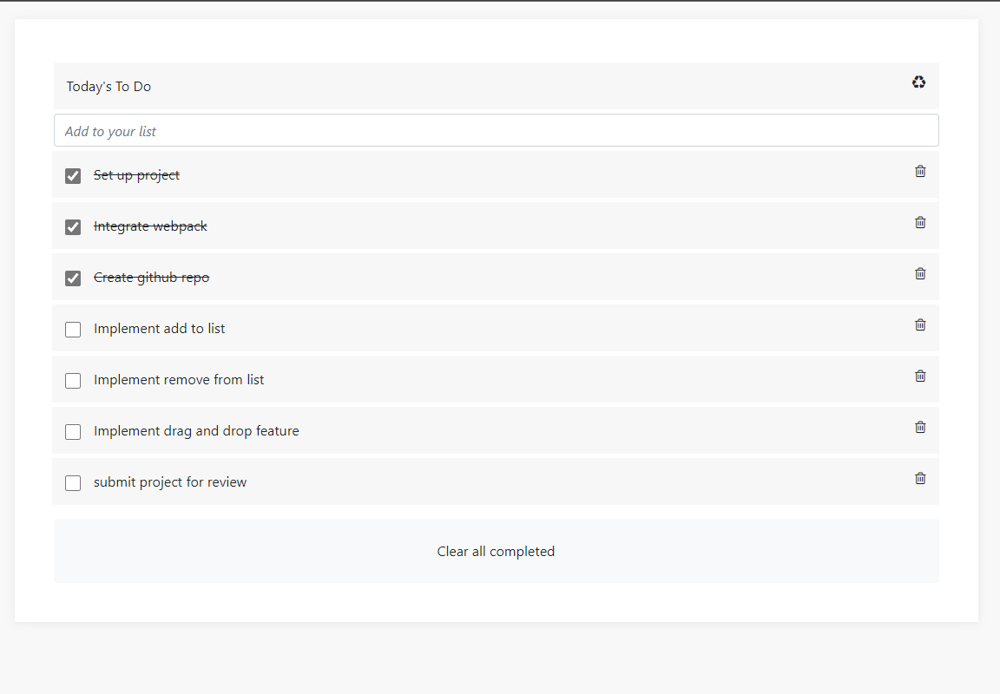

# 

## To Do List

> This is a website that makes your daily tasks easy, since you can list them and mark them as done once you finish them, and later you can remove them so you can create a new one again also you can close the website and open it again, it will just reload the saved information.

## 

## Built With

- Webpack
- Local Server
- HTML
- CSS
- JAVA SCRIPT
- LINTERS

## Live Demo (if available)

[Live Demo Link](https://andrelau11.github.io/To-Do-List/)

## Authors

👤 **Hector Andre Lau**

- GitHub: [@AndreLau11](https://github.com/AndreLau11)
- Twitter: [@HectorAndreLau](https://twitter.com/HectorAndreLau)
- LinkedIn: [@HectorAndreLauEstrada](https://www.linkedin.com/in/h%C3%A9ctor-andr%C3%A9-lau-estrada-b4947795/)

## 🤝 Contributing

Contributions, issues, and feature requests are welcome!

Feel free to check the [issues page](https://github.com/AndreLau11/To-Do-List/issues).

## Show your support

Give a ⭐️ if you like this project!

## Acknowledgments

- Hat tip to anyone whose code was used
- Inspiration
- etc

## 📝 License

This project is [MIT](./MIT.md) licensed.
